# VRB 网络结构绘制 2

本文按当前源码 `networks/` 目录整理 VRB 的总体网络结构，并用表格追踪每个主要模块的输入、来源、shape、输出和去向。

主要参考：

- `/Users/huhu/Documents/Code/bishe/vrb/networks/model.py`
- `/Users/huhu/Documents/Code/bishe/vrb/networks/traj.py`
- `/Users/huhu/Documents/Code/bishe/vrb/networks/layer.py`
- `/Users/huhu/Documents/Code/bishe/vrb/demo.py`
- `/Users/huhu/Documents/Code/bishe/vrb/inference.py`
- `/Users/huhu/Documents/Code/bishe/vrb/VRB.pdf`
- `/Users/huhu/Documents/Code/bishe/vrb/vrbreproduction/notebooks/data_processing_pipeline.ipynb`
- `/Users/huhu/Documents/Code/bishe/vrb/vrbreproduction/src/vrbreproduction/problem3_runner.py`
- `/Users/huhu/Documents/Code/bishe/vrb/vrbreproduction/src/vrbreproduction/label_heatmap_utils.py`

## 1. [表1] 默认配置与符号

`demo.py` 里的默认配置是本文主线：

| 配置项                      | 默认值        | 对结构的影响                                   |
| ------------------------ | ---------- | ---------------------------------------- |
| `resnet_type`            | `resnet18` | ResNet 全局输出 `src_in_features = 512`      |
| `cond_dim` / `embed_dim` | `256`      | Transformer Encoder 内部 token 维度为 256     |
| `hidden_dim`             | `192`      | CVAE 与可选 `var_MLP` 的隐藏层维度                |
| `hand_latent_dim`        | `4`        | 轨迹 CVAE latent 维度                        |
| `traj_len`               | `5`        | 预测 5 个轨迹点，轨迹向量维度 `2 * traj_len = 10`     |
| `n_maps`                 | `5`        | 每张 crop 预测 5 个候选接触点                      |
| `attn_kp`                | `1 / True` | 接触点分支使用空间 self-attention                 |
| `attn_kp_fc`             | `1 / True` | attention 后用 `fc_mu` 直接回归接触点坐标           |
| `var`                    | `False`    | 默认不预测接触点方差，推理时用 `[mu, mu]` 占位            |
| `enc_depth`              | `6`        | Transformer Encoder 有 6 个 `EncoderBlock` |
| `num_heads`              | `8`        | Transformer attention 头数为 8              |

符号约定：

| 符号 | 含义 |
| --- | --- |
| `B` | batch size |
| `T` | 时间维度。当前源码在 `VRBModel.forward/inference` 中把单张图整理成 `T=1` |
| `N` | patch / token 个数。当前默认 `num_patches=1` |
| `H, W` | 接触点分支里的空间特征图高宽 |
| `E` | Transformer embedding 维度，默认 `E=256` |
| `M` | 接触点候选数量，默认 `M=n_maps=5` |
| `L` | 轨迹点数量，默认 `L=traj_len=5` |

注意：`VRBModel.forward(self, feat, ...)` 和 `VRBModel.inference(self, feat, ...)` 里的参数名叫 `feat`，但实际传入的是预处理后的图像 crop，即 `img: B x 3 x 224 x 224`。

图中方括号是维度查询入口：

| 图中标记 | 对应位置 | 主要查询内容 |
| --- | --- | --- |
| `[表1]` | 1 默认配置与符号 | 默认开关值、`B/T/N/H/W/E/M/L` 等符号 |
| `[表3.1]` | 3.1 推理入口与图像输入 | 原图、bbox、crop、`img` 的来源和 shape |
| `[表3.2]` | 3.2 `encode_img(img)` | ResNet、decoder、contact head、`mu/cvar` 的逐层 shape |
| `[表3.3]` | 3.3 Transformer Encoder | `fe -> memory/context` 的 shape |
| `[表3.4]` | 3.4 `EncoderBlock` | Transformer block 内部 attention / MLP shape |
| `[表3.5]` | 3.5 `TrajAffCVAE` / `PosVAE` | `context -> future_hand` 的轨迹分支 shape |
| `[表3.6]` | 3.6 接触点输出和训练 loss | `obj_loss`、`pred_contact`、`var` 相关输出 |
| `[表4]` | 4 接触点分支源码开关 | `attn_kp` / `attn_kp_fc` 三条 contact 输出路径 |
| `[表5]` | 5 ResNet50 分支 shape 对照 | `resnet18` 与 `resnet50` 的通道差异 |
| `[表6]` | 6 训练与推理返回值 | `forward` 和 `inference` 的最终返回 |
| `[表3.7]` | 3.7 ground truth 与 loss 对照 | 论文数据处理节点 `Dxx` 和网络节点 `Nxx` 怎么接上 |
| `[表3.8]` | 3.8 数据处理节点变量表 | `Dxx` 节点中每个变量的含义、来源和 shape |

## 2. VRB 总体网络结构

```mermaid
flowchart TD
    scene["N01 模块: 原始场景图像<br/>输入: 无<br/>输入shape: -<br/>输出: image_pil<br/>输出shape: H0 x W0 x 3<br/>参考: 表3.1"]
    langsam["N02 模块: LangSAM 目标分割/检测<br/>输入: image_pil + objects<br/>输入shape: H0 x W0 x 3 + 目标词列表<br/>输出: boxes / masks<br/>输出shape: boxes约 K x 4<br/>参考: 表3.1"]
    boxes["N03 模块: bbox 选择与整理<br/>输入: boxes / masks<br/>输入shape: boxes约 K x 4<br/>输出: 每个目标的 crop box<br/>输出shape: [y1, x1, y2, x2]<br/>参考: 表3.1"]
    crop["N04 模块: crop + Resize + Normalize<br/>输入: image_pil + crop box<br/>输入shape: H0 x W0 x 3 + [4]<br/>输出: inp_img<br/>输出shape: 1 x 3 x 224 x 224<br/>参考: 表3.1"]
    img["N05 模块: VRB 输入图像张量<br/>输入: inp_img<br/>输入shape: 1 x 3 x 224 x 224<br/>输出: img / feat参数<br/>输出shape: B x 3 x 224 x 224<br/>参考: 表3.1"]

    subgraph vrb["VRBModel.forward / inference"]
        encimg["N06 模块: encode_img(img)<br/>输入: img<br/>输入shape: B x 3 x 224 x 224<br/>输出: fe, mu, cvar<br/>输出shape: fe B x src_in_features，mu B x 5 x 2，cvar 0或B x 5 x 2<br/>参考: 表3.2"]
        resq{"N07 模块: resnet_type 开关<br/>输入: args.resnet_type<br/>输入shape: 标量字符串<br/>输出: resnet18 或 resnet50 分支<br/>输出shape: -<br/>参考: 表1, 表5"}
        r18note["N08 模块: resnet18 配置<br/>输入: resnet_type=resnet18<br/>输入shape: 标量<br/>输出: src_in_features / conv4通道<br/>输出shape: 512 / B x 512 x 7 x 7<br/>参考: 表1, 表5"]
        r50note["N09 模块: resnet50 配置<br/>输入: resnet_type=resnet50<br/>输入shape: 标量<br/>输出: src_in_features / conv4通道<br/>输出shape: 2048 / B x 2048 x 7 x 7<br/>参考: 表5"]

        subgraph backbone["共享 ResNet / R3M-like backbone [表3.2 + 表5]"]
            stem["N10 模块: ResNet stem<br/>输入: img<br/>输入shape: B x 3 x 224 x 224<br/>输出: stem特征 x<br/>输出shape: B x 64 x 56 x 56<br/>参考: 表3.2"]
            l1["N11 模块: ResNet layer1<br/>输入: stem特征 x<br/>输入shape: B x 64 x 56 x 56<br/>输出: conv1变量<br/>输出shape: B x 64 x 56 x 56<br/>参考: 表3.2"]
            l2["N12 模块: ResNet layer2<br/>输入: conv1变量<br/>输入shape: B x 64 x 56 x 56<br/>输出: conv2变量<br/>输出shape: res18 B x 128 x 28 x 28，res50 B x 512 x 28 x 28<br/>参考: 表3.2, 表5"]
            l3["N13 模块: ResNet layer3<br/>输入: conv2变量<br/>输入shape: res18 B x 128 x 28 x 28，res50 B x 512 x 28 x 28<br/>输出: conv3变量<br/>输出shape: res18 B x 256 x 14 x 14，res50 B x 1024 x 14 x 14<br/>参考: 表3.2, 表5"]
            l4["N14 模块: ResNet layer4<br/>输入: conv3变量<br/>输入shape: res18 B x 256 x 14 x 14，res50 B x 1024 x 14 x 14<br/>输出: conv4变量<br/>输出shape: res18 B x 512 x 7 x 7，res50 B x 2048 x 7 x 7<br/>参考: 表3.2, 表5"]
            pool["N15 模块: avgpool + flatten + fc Identity<br/>输入: conv4变量<br/>输入shape: res18 B x 512 x 7 x 7，res50 B x 2048 x 7 x 7<br/>输出: 全局语义特征 feat<br/>输出shape: res18 B x 512，res50 B x 2048<br/>参考: 表3.2, 表5"]
            fe["N16 模块: fe 全局特征节点<br/>输入: feat<br/>输入shape: res18 B x 512，res50 B x 2048<br/>输出: fe<br/>输出shape: res18 B x 512，res50 B x 2048<br/>参考: 表3.2, 表5"]
        end

        subgraph contact["接触点分支 Contact Head [表3.2 + 表4]"]
            d1["N17 模块: deconv1 + BN + ReLU<br/>输入: conv4变量<br/>输入shape: res18 B x 512 x 7 x 7，res50 B x 2048 x 7 x 7<br/>输出: 上采样特征 h<br/>输出shape: res18 B x 256 x 14 x 14，res50 B x 1024 x 14 x 14<br/>参考: 表3.2, 表5"]
            add3["N18 模块: skip add h + conv3<br/>输入: h + conv3变量<br/>输入shape: res18 B x 256 x 14 x 14，res50 B x 1024 x 14 x 14<br/>输出: 融合特征<br/>输出shape: res18 B x 256 x 14 x 14，res50 B x 1024 x 14 x 14<br/>参考: 表3.2, 表5"]
            d2["N19 模块: deconv2 + BN + ReLU<br/>输入: 融合特征<br/>输入shape: res18 B x 256 x 14 x 14，res50 B x 1024 x 14 x 14<br/>输出: 上采样特征 h<br/>输出shape: res18 B x 128 x 28 x 28，res50 B x 512 x 28 x 28<br/>参考: 表3.2, 表5"]
            add2["N20 模块: skip add h + conv2<br/>输入: h + conv2变量<br/>输入shape: res18 B x 128 x 28 x 28，res50 B x 512 x 28 x 28<br/>输出: 融合特征<br/>输出shape: res18 B x 128 x 28 x 28，res50 B x 512 x 28 x 28<br/>参考: 表3.2, 表5"]
            d3["N21 模块: deconv3 + BN + ReLU<br/>输入: 融合特征<br/>输入shape: res18 B x 128 x 28 x 28，res50 B x 512 x 28 x 28<br/>输出: decoder h<br/>输出shape: res18 B x 64 x 56 x 56，res50 B x 128 x 110 x 110<br/>参考: 表3.2, 表5"]
            attnq{"N22 模块: attn_kp 开关<br/>输入: decoder h + attn_kp<br/>输入shape: h为 B x C x H x W，attn_kp为布尔值<br/>输出: attention路径或heatmap路径<br/>输出shape: -<br/>参考: 表4"}
            cb_attn["N23 模块: attn=True 的 cb1 + cb2<br/>输入: decoder h<br/>输入shape: B x C x H x W<br/>输出: 接触点空间特征 x<br/>输出shape: B x 64 x H x W<br/>参考: 表3.2, 表4"]
            flat["N24 模块: flatten + transpose<br/>输入: 接触点空间特征 x<br/>输入shape: B x 64 x H x W<br/>输出: 空间token序列<br/>输出shape: B x H*W x 64<br/>参考: 表3.2"]
            pos2d["N25 模块: 2D位置编码相加<br/>输入: 空间token序列<br/>输入shape: B x H*W x 64<br/>输出: 带位置的空间token<br/>输出shape: B x H*W x 64<br/>参考: 表3.2"]
            sattn["N26 模块: MultiheadAttention<br/>输入: Q/K/V空间token<br/>输入shape: B x H*W x 64<br/>输出: attention token<br/>输出shape: B x H*W x 64<br/>参考: 表3.2"]
            restore["N27 模块: transpose + view<br/>输入: attention token<br/>输入shape: B x H*W x 64<br/>输出: attn_output<br/>输出shape: B x 64 x H x W<br/>参考: 表3.2"]
            fcq{"N28 模块: attn_kp_fc 开关<br/>输入: attn_output + attn_kp_fc<br/>输入shape: B x 64 x H x W + 布尔值<br/>输出: A直接回归路径或B heatmap路径<br/>输出shape: -<br/>参考: 表4"}
            fcmu["N29 模块: adaptive avg pool + fc_mu<br/>输入: attn_output<br/>输入shape: B x 64 x H x W<br/>输出: mu_flat<br/>输出shape: B x 10<br/>参考: 表3.2, 表4"]
            cb3["N30 模块: cb3 生成heatmap<br/>输入: attn_output<br/>输入shape: B x 64 x H x W<br/>输出: contact heatmap<br/>输出shape: B x 5 x H x W<br/>参考: 表4"]
            cb_heat["N31 模块: attn=False 的 cb1 + cb2<br/>输入: decoder h<br/>输入shape: B x C x H x W<br/>输出: contact heatmap<br/>输出shape: B x 5 x H x W<br/>参考: 表4"]
            coord["N32 模块: get_coord<br/>输入: contact heatmap<br/>输入shape: B x 5 x H x W<br/>输出: cx/cy坐标分量<br/>输出shape: 每个为 B x 5<br/>参考: 表4"]
            mu["N33 模块: mu 接触点坐标<br/>输入: mu_flat 或 cx/cy坐标分量<br/>输入shape: B x 10 或 2个 B x 5<br/>输出: mu<br/>输出shape: B x 5 x 2<br/>参考: 表3.6, 表4"]
            varq{"N34 模块: var 开关<br/>输入: fe + var<br/>输入shape: fe为 B x src_in_features，var为布尔值<br/>输出: cvar预测路径或占位路径<br/>输出shape: -<br/>参考: 表3.2, 表3.6"}
            varmlp["N35 模块: var_MLP<br/>输入: fe<br/>输入shape: res18 B x 512，res50 B x 2048<br/>输出: cvar<br/>输出shape: B x 5 x 2<br/>参考: 表3.2, 表3.6"]
            cvar0["N36 模块: cvar默认占位<br/>输入: var=False + mu<br/>输入shape: 布尔值 + B x 5 x 2<br/>输出: cvar占位<br/>输出shape: 训练为0，推理复用mu B x 5 x 2<br/>参考: 表3.6"]
            predtrue["N37 模块: pred_contact var=True<br/>输入: mu + cvar<br/>输入shape: B x 5 x 2 + B x 5 x 2<br/>输出: pred_contact<br/>输出shape: B x 2 x 5 x 2<br/>参考: 表3.6"]
            predfalse["N38 模块: pred_contact var=False<br/>输入: mu + mu<br/>输入shape: B x 5 x 2 + B x 5 x 2<br/>输出: pred_contact<br/>输出shape: B x 2 x 5 x 2<br/>参考: 表3.6"]
        end

        subgraph traj["轨迹分支 Trajectory Head [表3.3 + 表3.5]"]
            reshape["N39 模块: fe.reshape<br/>输入: fe<br/>输入shape: res18 B x 512，res50 B x 2048<br/>输出: 单帧单token特征<br/>输出shape: B x 1 x 1 x src_in_features<br/>参考: 表3.3"]
            down["N40 模块: downproject Linear<br/>输入: 单帧单token特征<br/>输入shape: B x 1 x 1 x src_in_features<br/>输出: 降维token<br/>输出shape: B x 1 x 1 x 256<br/>参考: 表3.3"]
            encin["N41 模块: encoder_input transpose<br/>输入: 降维token<br/>输入shape: B x 1 x 1 x 256<br/>输出: Encoder输入<br/>输出shape: B x 1 x 1 x 256<br/>参考: 表3.3"]
            encoder["N42 模块: Transformer Encoder x 6<br/>输入: Encoder输入 + src_mask<br/>输入shape: B x 1 x 1 x 256 + B x 1 x 1<br/>输出: Encoder输出 x<br/>输出shape: B x 1 x 1 x 256<br/>参考: 表3.3, 表3.4"]
            memory["N43 模块: memory[:,0,:]<br/>输入: Encoder输出 x<br/>输入shape: B x 1 x 1 x 256<br/>输出: context<br/>输出shape: B x 256<br/>参考: 表3.3"]
            condq{"N44 模块: condition_contact 开关<br/>输入: context + condition_contact<br/>输入shape: B x 256 + 布尔值<br/>输出: 默认context或融合context<br/>输出shape: B x 256<br/>参考: 表3.5"}
            condfalse["N45 模块: 默认轨迹条件<br/>输入: context<br/>输入shape: B x 256<br/>输出: condition_context<br/>输出shape: B x 256<br/>参考: 表3.5"]
            condtrue["N46 模块: contact条件融合<br/>输入: context + contact_point<br/>输入shape: B x 256 + B x 2<br/>输出: condition_context<br/>输出shape: B x 256<br/>参考: 表3.5"]
            hand["N47 模块: TrajAffCVAE / PosVAE<br/>输入: condition_context<br/>输入shape: B x 256<br/>输出: recon_x<br/>输出shape: B x 10<br/>参考: 表3.5"]
            future["N48 模块: future_hand reshape<br/>输入: recon_x<br/>输入shape: B x 10<br/>输出: future_hand<br/>输出shape: B x 5 x 2<br/>参考: 表6"]
        end
    end

    scene --> langsam --> boxes --> crop --> img
    img --> encimg --> resq
    resq -- "resnet18 默认" --> r18note --> stem
    resq -- "resnet50" --> r50note --> stem
    stem --> l1 --> l2 --> l3 --> l4
    l4 --> pool --> fe
    l4 --> d1 --> add3
    l3 --> add3
    add3 --> d2 --> add2
    l2 --> add2
    add2 --> d3 --> attnq
    attnq -- "True" --> cb_attn --> flat --> pos2d --> sattn --> restore --> fcq
    fcq -- "True 默认 / A" --> fcmu --> mu
    fcq -- "False / B" --> cb3 --> coord --> mu
    attnq -- "False / C" --> cb_heat --> coord
    fe --> varq
    varq -- "True" --> varmlp --> predtrue
    varq -- "False 默认" --> cvar0 --> predfalse
    mu --> predtrue
    mu --> predfalse
    fe --> reshape --> down --> encin --> encoder --> memory --> condq
    condq -- "False 默认" --> condfalse --> hand
    condq -- "True" --> condtrue --> hand
    hand --> future
```



>总的来说是两条路
>	- 接触点：img -> ResNet 空间特征 conv2/conv3/conv4 -> deconv + skip -> mu
>	- 轨迹：img -> ResNet 全局特征 fe -> Transformer Encoder -> TrajAffCVAE -> future_hand
>	- 
> 	

这张图可以按两条输出和五个开关读：

| 输出                          | 数据主线                                                           | 作用                  |
| --------------------------- | -------------------------------------------------------------- | ------------------- |
| `pred_contact` / `obj_loss` | `img -> ResNet空间特征 -> deconv decoder -> attention/fc_mu -> mu` | 预测可接触位置             |
| `future_hand` / `traj_loss` | `img -> ResNet全局特征 fe -> Transformer Encoder -> TrajAffCVAE`   | 预测接触后的手腕轨迹 waypoint |

| 开关                  | 默认值        | 图中分支                                                               | 查哪里               |
| ------------------- | ---------- | ------------------------------------------------------------------ | ----------------- |
| `resnet_type`       | `resnet18` | 决定 backbone 全局特征维度和 decoder 通道数                                    | `[表1]`、`[表5]`     |
| `attn_kp`           | `True`     | `True` 走空间 attention；`False` 直接把 `cb1/cb2` 输出当 heatmap 解码          | `[表4]`            |
| `attn_kp_fc`        | `True`     | 只在 `attn_kp=True` 时生效；`True` 走 `fc_mu`，`False` 走 `cb3 + get_coord` | `[表4]`            |
| `var`               | `False`    | `True` 预测 `cvar`；`False` 训练不算方差，推理用 `[mu, mu]` 占位                  | `[表3.2]`、`[表3.6]` |
| `condition_contact` | `False`    | 轨迹 CVAE 是否把 `contact_point` 融入 `context`；当前 demo 构造时未启用            | `[表3.5]`          |

## 3. [表3.7] Ground Truth、Loss 与总体网络节点对照

这一节专门回答：**VRB 计算 loss 时的 ground truth 是什么，变量从哪里来，又和上面的 `N01-N48` 网络结构图哪个节点对上。**

先给结论：

| 监督对象               | ground truth 是什么                                           | 网络预测节点                            | loss 公式                                                      |
| ------------------ | ---------------------------------------------------------- | --------------------------------- | ------------------------------------------------------------ |
| 接触点 `contact`      | `gt_mu`：人手-物体接触区域点集拟合 GMM 后得到的 `K=5` 个中心点                  | `N33 mu`                          | 默认 `obj_loss = 5 * mean((mu - gt_mu)^2)`                     |
| 接触点方差 `cvar`       | `gt_cvar`：可选 covariance/variance 标签；论文主线说固定 covariance 更稳定 | `N35 cvar`                        | 仅 `var=True` 时加 `mean((cvar - gt_cvar)^2)`                   |
| 接触后轨迹 `trajectory` | `future_hands`：接触后 active hand 的 2D waypoint 序列            | `N47 recon_x` / `N48 future_hand` | `traj_loss = mean(sum((recon_x - flatten(future_hands))^2))` |
| CVAE KL            | 不是外部标签，是 `PosVAE` latent 分布正则                              | `N47 mean/log_var`                | `KLD = -0.5 * sum(1 + log_var - mean^2 - exp(log_var))`      |

关键点：

- **当前源码里的 contact ground truth 是坐标 `gt_mu: B x 5 x 2`，不是整张 heatmap。**
- 论文写法是 `heatmap -> spatial softmax -> mu`，loss 仍然落在 `mu` 坐标上。
- 当前 demo 默认 `attn_kp=True, attn_kp_fc=True`，走 `N29 fc_mu -> N33 mu`，直接回归 5 个接触点坐标。
- 你的 `src/vrbreproduction/label_heatmap_utils.py` 生成的 `merged_heatmap` 是可视化/对比标签，对应论文直觉里的 contact heatmap，但当前 `networks/model.py` 的 `obj_loss` 不做逐像素 heatmap loss。
- 本地仓库没有训练脚本和 dataloader，所以最终总 loss 怎么加权没有出现在源码里。能确定的是 `VRBModel.forward` 返回 `traj_loss, traj_kl_loss, obj_loss, obj_kl_loss`。

### 3.7.1 论文数据处理流程图（D 节点）

下面的 `Dxx` 节点描述训练标签怎么从人类视频中产生。它不是另一个网络，而是**给上方 `Nxx` 网络节点提供监督信号的数据处理链路**。

```mermaid
flowchart TD
    d01["D01 原始人类视频<br/>操作: 读取 EPIC-Kitchens 子动作视频<br/>输入: 无<br/>输入shape: -<br/>输出: V={I_1...I_T}<br/>输出shape: T_video x H0 x W0 x 3"]
    d02["D02 100DOH/HOA 检测<br/>操作: 每帧检测左右手、物体和接触状态<br/>输入: V<br/>输入shape: T_video x H0 x W0 x 3<br/>输出: hand_boxes, object_boxes, contact_states<br/>输出shape: T_video x 2 x 4, T_video x Q x 4, T_video x 2"]
    d03["D03 接触变量二值化和平滑<br/>操作: Portable/Fixed 记 1，Savitzky-Golay 平滑，阈值 0.75<br/>输入: contact_states<br/>输入shape: T_video x 2<br/>输出: left_contact_smooth, right_contact_smooth<br/>输出shape: T_video, T_video"]
    d04["D04 找 first contact 和 active hand<br/>操作: 找第一个接触帧和主动手<br/>输入: left/right_contact_smooth<br/>输入shape: T_video, T_video<br/>输出: t_contact, active_hand<br/>输出shape: scalar, scalar"]

    d05["D05 接触帧几何信息<br/>操作: 读取接触帧，取 active hand 框和物体框<br/>输入: V, detections, t_contact, active_hand<br/>输入shape: T_video x H0 x W0 x 3, detections, scalar, scalar<br/>输出: I_contact, b_hand, b_obj<br/>输出shape: H0 x W0 x 3, 4, Q_valid x 4"]
    d06["D06 手部分割和边缘点<br/>操作: 在 b_hand 内做 skin segmentation，再取 hand edge<br/>输入: I_contact, b_hand<br/>输入shape: H0 x W0 x 3, 4<br/>输出: hand_skin_mask, hand_edge_points<br/>输出shape: H0 x W0, N_edge x 2"]
    d07["D07 接触候选点<br/>操作: 取 hand_edge_points 与 b_obj 相交的点<br/>输入: hand_edge_points, b_obj<br/>输入shape: N_edge x 2, Q_valid x 4<br/>输出: contact_points={c_i}<br/>输出shape: N_c x 2"]
    d08["D08 GMM 接触标签<br/>操作: 对 contact_points 拟合 K=5 GMM<br/>输入: contact_points<br/>输入shape: N_c x 2<br/>输出: mu_contact, Sigma, alpha<br/>输出shape: 5 x 2, 5 x 2 x 2, 5"]

    d09["D09 human-less reference frame<br/>操作: 找接触前无人手帧<br/>输入: detections, t_contact<br/>输入shape: detections, scalar<br/>输出: ref_idx, I_ref<br/>输出shape: scalar, H0 x W0 x 3"]
    d10["D10 homography 累计<br/>操作: 估计每个目标帧到 reference frame 的单应性<br/>输入: I_ref...I_t<br/>输入shape: S x H0 x W0 x 3<br/>输出: H_{s_to_ref}<br/>输出shape: S x 3 x 3"]
    d11["D11 接触点投影到 reference frame<br/>操作: mu_ref = H_contact_to_ref(mu_contact)<br/>输入: mu_contact, H_contact_to_ref<br/>输入shape: 5 x 2, 3 x 3<br/>输出: mu_ref / mu_transformed<br/>输出shape: 5 x 2"]

    d12["D12 post-contact 手部轨迹<br/>操作: 从 t_contact 开始取 active hand bbox 中心<br/>输入: detections, active_hand<br/>输入shape: detections, scalar<br/>输出: trajectory_pixels<br/>输出shape: L_raw x 2"]
    d13["D13 轨迹投影到 reference frame<br/>操作: tau_abs_ref_l = H_{t+l_to_ref}(hand_center_{t+l})<br/>输入: trajectory_pixels, H_{s_to_ref}<br/>输入shape: L_raw x 2, S x 3 x 3<br/>输出: tau_abs_ref / tau_transformed<br/>输出shape: L_raw x 2"]

    d14["D14 crop 与坐标归一化<br/>操作: 围绕接触区域取 crop，并转为 crop 内归一化坐标<br/>输入: I_ref, mu_ref, tau_abs_ref<br/>输入shape: H0 x W0 x 3, 5 x 2, L_raw x 2<br/>输出: img, gt_mu, future_hands, future_valid<br/>输出shape: B x 3 x 224 x 224, B x 5 x 2, B x 5 x 2, B x 5"]
    d15["D15 可视化 label heatmap<br/>操作: 用 mu_ref 生成 Gaussian heatmap<br/>输入: mu_ref, alpha(optional)<br/>输入shape: 5 x 2, 5<br/>输出: per_mode_heatmaps, merged_heatmap<br/>输出shape: 5 x H0 x W0, H0 x W0"]

    n05["N05 VRB 输入图像张量<br/>输入: img<br/>输入shape: B x 3 x 224 x 224<br/>输出: img / feat参数<br/>输出shape: B x 3 x 224 x 224"]
    n33["N33 mu 接触点坐标<br/>输入: N29 mu_flat 或 N32 cx/cy<br/>输入shape: B x 10 或 2个 B x 5<br/>输出: mu<br/>输出shape: B x 5 x 2"]
    n35["N35 cvar 可选方差<br/>输入: fe<br/>输入shape: B x 512<br/>输出: cvar<br/>输出shape: B x 5 x 2"]
    n47["N47 TrajAffCVAE<br/>输入: context + future_hands<br/>输入shape: B x 256 + B x 5 x 2<br/>输出: recon_x, mean, log_var<br/>输出shape: B x 10, B x latent_dim, B x latent_dim"]
    n48["N48 future_hand reshape<br/>输入: recon_x<br/>输入shape: B x 10<br/>输出: future_hand<br/>输出shape: B x 5 x 2"]

    loss1["Loss A: obj_loss<br/>输入: N33 mu + D14 gt_mu<br/>输入shape: B x 5 x 2 + B x 5 x 2<br/>输出: contact loss<br/>输出shape: scalar"]
    loss2["Loss B: traj_loss / traj_kl_loss<br/>输入: N47 recon_x + D14 future_hands + mean/log_var<br/>输入shape: B x 10 + B x 5 x 2 + latent params<br/>输出: trajectory losses<br/>输出shape: scalar, scalar"]

    d01 --> d02 --> d03 --> d04
    d04 --> d05 --> d06 --> d07 --> d08
    d04 --> d09 --> d10
    d08 --> d11
    d10 --> d11
    d04 --> d12 --> d13
    d10 --> d13
    d11 --> d14
    d13 --> d14
    d11 --> d15
    d14 --> n05
    n05 --> n33 --> loss1
    d14 -- "gt_mu" --> loss1
    n05 --> n47 --> n48
    d14 -- "future_hands" --> n47
    n47 --> loss2
    d14 -- "future_hands / future_valid" --> loss2
    n35 -. "var=True 时和 gt_cvar 对比" .-> loss1
```



### 3.7.2 D 节点与 N 节点如何对照

| 数据处理节点       | 产物                              | 对应总体网络节点                  | 对照关系                                                                    |
| ------------ | ------------------------------- | ------------------------- | ----------------------------------------------------------------------- |
| `D14`        | `img / feat: B x 3 x 224 x 224` | `N05`                     | 数据处理把 human-less reference crop 变成模型输入。源码 `forward` 参数名叫 `feat`，但实际是图像。 |
| `D14`        | `gt_mu: B x 5 x 2`              | `N33 mu`                  | `gt_mu` 是接触点坐标标签，和 contact head 输出 `mu` 做 MSE。                          |
| `D14`        | `future_hands: B x 5 x 2`       | `N47/N48`                 | `future_hands` 是轨迹标签，训练时作为 `N47` 输入并和 `recon_x` 算重建误差。                  |
| `D14`        | `future_valid: B x 5`           | `N47 TrajAffCVAE.forward` | 表示未来轨迹点有效性。当前源码主要用它取 batch size，没有在 MSE 里实际 mask。                       |
| `D08/D14` 可选 | `gt_cvar: B x 5 x 2`            | `N35 cvar`                | 只有 `var=True` 时才监督方差。默认 `var=False` 不使用。                                |
| `D15`        | `merged_heatmap: H0 x W0`       | `N30/N31 contact heatmap` | 这是可视化/诊断用标签，不是当前默认 `obj_loss` 的直接监督张量。                                  |

训练时两条主线可以合成一句话：

```text
D14 img -> N05 -> N33 mu
D14 gt_mu -----------------> obj_loss

D14 img -> N05 -> N16 -> N43 context -> N47/N48 future_hand
D14 future_hands ---------------------> traj_loss / traj_kl_loss
```

### 3.7.3 loss 公式

`networks/model.py` 里接触点 loss：

```python
gt_mu, gt_cvar = contact_point[:, :self.n_maps], contact_point[:, self.n_maps:]
if self.var:
    obj_loss = self.mean_lmbda * torch.mean((mu - gt_mu) ** 2) + torch.mean((cvar - gt_cvar) ** 2)
else:
    obj_loss = self.mean_lmbda * torch.mean((mu - gt_mu) ** 2)
```

默认 `self.mean_lmbda = 5`，`var=False`：

```text
L_contact = 5 * mean_{b,k,d} (mu_pred[b,k,d] - gt_mu[b,k,d])^2
```

`networks/traj.py` 里轨迹 loss：

```python
x = target_hand.reshape(B, -1)
recon_loss = torch.sum((recon_x - x) ** 2, dim=1)
KLD = -0.5 * torch.sum(1 + log_var - mean.pow(2) - log_var.exp(), dim=1)
traj_loss = recon_loss.mean()
traj_kl_loss = KLD.sum()
```

公式：

```text
x_b = flatten(future_hands_b) in R^10
L_traj = (1 / B) * sum_b sum_j (recon_x_b[j] - x_b[j])^2
L_KL = sum_b -0.5 * sum_m (1 + log_var_b[m] - mean_b[m]^2 - exp(log_var_b[m]))
```

## 4. [表3.8] 数据处理节点变量详解

这一张表专门解释 `D01-D15` 节点里出现的每一个变量。读这张表时可以对照上面的 D 节点流程图和第 2 节的 `N01-N48` 总体网络图。

| 节点 | 变量 | shape | 变量是什么意思 | 从哪里来 | 去哪里 |
| --- | --- | --- | --- | --- | --- |
| `D01` | `V` | `T_video x H0 x W0 x 3` | 一段人类第一视角操作视频。`T_video` 是帧数，`H0/W0` 是原始帧高宽。 | EPIC-Kitchens 子动作视频 | `D02` |
| `D01` | `I_t` | `H0 x W0 x 3` | 视频中的第 `t` 帧 RGB 图像。 | `V` 的单帧 | `D02`, `D05`, `D09` |
| `D02` | `detections` | 每帧一个检测结构 | 每帧所有手、物体、手-物接触状态的集合。 | 100DOH/HOA 标注或检测器输出 | `D03`, `D04`, `D05`, `D09`, `D12` |
| `D02` | `hand_boxes` | `T_video x 2 x 4` | 每帧左/右手 bbox，4 个数通常是 `[x1,y1,x2,y2]` 或归一化等价形式。 | `detections[frame].hands` | `D05`, `D12` |
| `D02` | `object_boxes` | `T_video x Q x 4` | 每帧检测到的物体 bbox，`Q` 是该帧物体数。 | `detections[frame].objects` | `D05`, `D07` |
| `D02` | `contact_states` | `T_video x 2` | 左/右手的接触离散状态，例如 portable object、stationary object、no contact。 | hand-object annotation | `D03` |
| `D03` | `left_contact_smooth` | `T_video` | 左手是否处于有效接触的平滑二值序列。 | 左手 `contact_states` 二值化后 Savitzky-Golay 平滑 | `D04` |
| `D03` | `right_contact_smooth` | `T_video` | 右手是否处于有效接触的平滑二值序列。 | 右手 `contact_states` 二值化后 Savitzky-Golay 平滑 | `D04` |
| `D04` | `t_contact` | scalar | 第一次发生有效 hand-object contact 的帧索引。 | `left_contact_smooth/right_contact_smooth` 的第一个有效位置 | `D05`, `D09`, `D12` |
| `D04` | `active_hand` | scalar/string | 首次接触来自哪只手，通常是 `left` 或 `right`。 | 哪只手先达到接触阈值 | `D05`, `D12` |
| `D05` | `I_contact` | `H0 x W0 x 3` | 接触发生时的图像帧。 | `V[t_contact]` | `D06` |
| `D05` | `b_hand` | `4` | active hand 在接触帧上的 bbox。 | `detections[t_contact].hands` 中匹配 `active_hand` 的手 | `D06` |
| `D05` | `b_obj` | `Q_valid x 4` | 接触帧中有效物体 bbox 集合。 | `detections[t_contact].objects` 过滤低置信度后得到 | `D07` |
| `D06` | `hand_skin_mask` | `H0 x W0` | 手部区域二值 mask，手部像素为 1，其余为 0。 | 在 `I_contact` 的 `b_hand` 内做 skin segmentation | `D06` 内部继续取边缘 |
| `D06` | `hand_edge_points` | `N_edge x 2` | 手部 mask 的边缘像素点坐标，坐标通常是 `(x,y)`。 | `hand_skin_mask - erode(hand_skin_mask)` | `D07` |
| `D07` | `contact_points` / `{c_i}` | `N_c x 2` | 候选接触点集合：落在物体框里的手部边缘点。`N_c` 每个样本不同。 | `hand_edge_points` 与 `b_obj` 的几何相交 | `D08` |
| `D08` | `K` | scalar，默认 `5` | GMM mode 数量，也对应模型预测的接触点数量 `n_maps=5`。 | 论文和 `demo.py` 默认配置 | `D08`, `N33` |
| `D08` | `mu_contact` | `5 x 2` | GMM 的 5 个中心点，仍在 contact frame 坐标系。 | `GaussianMixture(n_components=5).fit(contact_points).means_` | `D11` |
| `D08` | `Sigma` | `5 x 2 x 2` | GMM covariance。论文说固定 covariance 更稳定，源码默认不监督它。 | GMM 拟合得到 | 可选生成 `gt_cvar` |
| `D08` | `alpha` | `5` | GMM mixture weights，表示每个接触 mode 的权重。 | GMM 拟合得到 | `D15` 可用于热图强度 |
| `D09` | `ref_idx` | scalar | human-less reference frame 的帧索引，即接触前无人手的参考帧。 | 从 `t_contact` 向前搜索无手帧 | `D10`, `D14` |
| `D09` | `I_ref` | `H0 x W0 x 3` | reference frame 图像。训练输入 crop 从它来，避免人手域偏移。 | `V[ref_idx]` | `D10`, `D14` |
| `D10` | `H_{s_to_ref}` | `S x 3 x 3` | 每个目标帧到 reference frame 的 homography。 | 相邻帧静态区域特征匹配和 RANSAC 累计 | `D11`, `D13` |
| `D10` | `H_contact_to_ref` | `3 x 3` | 接触帧到 reference frame 的 homography。 | `H_{s_to_ref}` 中 `s=t_contact` 的矩阵 | `D11` |
| `D11` | `mu_ref` / `mu_transformed` | `5 x 2` | `mu_contact` 投影到 reference frame 后的接触点中心。 | `H_contact_to_ref(mu_contact)` | `D14`, `D15` |
| `D12` | `trajectory_pixels` | `L_raw x 2` | 接触后 active hand bbox 中心点序列，还在各自原始帧坐标系。 | `detections[t_contact + offset]` 中 active hand bbox 中心 | `D13` |
| `D12` | `L_raw` | scalar | 原始提取到的轨迹点个数。你的复现当前最多取 6，模型默认 `traj_len=5`。 | 可用 hand detection 数量 | `D13`, `D14` |
| `D13` | `tau_abs_ref` / `tau_transformed` | `L_raw x 2` | 轨迹点投影到 reference frame 后的绝对像素坐标序列。 | `H_{t+l_to_ref}(trajectory_pixels[l])` | `D14` |
| `D14` | `crop_box` | `4` | 围绕接触区域从 `I_ref` 截取局部图像的框。论文 appendix 写使用 `150 x 150` crop。 | 由 `mu_ref/tau_abs_ref` 附近区域确定 | `D14` 内部 crop 和坐标归一化 |
| `D14` | `img` / `feat` | `B x 3 x 224 x 224` | 送入 VRB 的训练图像张量。源码里 `forward` 参数名叫 `feat`，实际是图像。 | `I_ref[crop_box]` resize 到 224 并 normalize | `N05` |
| `D14` | `gt_mu` | `B x 5 x 2` | 接触点 ground truth。来自 `mu_ref`，转成 crop 内归一化坐标。 | `mu_ref + crop_box` 坐标变换 | 和 `N33 mu` 算 `obj_loss` |
| `D14` | `contact_point` | 常见 `B x 5 x 2` 或 `B x 10 x 2` | `VRBModel.forward` 接收的接触标签容器。源码用前 `5` 个作为 `gt_mu`，后 `5` 个可作为 `gt_cvar`。 | dataloader 打包 `gt_mu/gt_cvar` | `VRBModel.forward` |
| `D14` | `gt_cvar` | 可选 `B x 5 x 2` | 方差/covariance 标签。默认不使用。 | GMM covariance 或固定方差整理得到 | `var=True` 时和 `N35 cvar` 算 loss |
| `D14` | `future_hands` | `B x 5 x 2` | 轨迹 ground truth。来自 `tau_abs_ref`，转成 crop 内归一化坐标或相对位移。 | `tau_abs_ref + crop_box` 以及 dataloader 轨迹整理 | `N47` 训练输入，并和 `recon_x` 算 `traj_loss` |
| `D14` | `future_valid` | `B x 5` | 哪些未来轨迹点有效的 mask。 | 轨迹点是否存在、是否越界 | `TrajAffCVAE.forward` |
| `D15` | `per_mode_heatmaps` | `5 x H0 x W0` | 每个 GMM mode 一张 Gaussian label heatmap。 | 以 `mu_ref[k]` 为中心生成高斯 | 可视化/诊断 |
| `D15` | `merged_heatmap` | `H0 x W0` | 多个 mode 合并后的 label heatmap。 | `per_mode_heatmaps` 取 max 或 sum 后归一化 | 和模型预测热图做可视化对比 |

## 5. [表3.9] Loss 中网络变量详解

| 网络/loss 变量 | 对应总体网络节点 | shape | 含义 |
| --- | --- | --- | --- |
| `mu` | `N33` | `B x 5 x 2` | contact head 预测的 5 个接触点坐标。默认由 `N29 fc_mu` 直接输出。 |
| `cvar` | `N35/N36` | `0` 或 `B x 5 x 2` | contact variance。默认 `var=False` 时训练中是 `0`，推理时用 `mu` 占位。 |
| `fe` | `N16` | 默认 `B x 512` | ResNet 全局特征，给 trajectory head 做条件，也可给 `var_MLP` 预测 `cvar`。 |
| `context` | `N43` | `B x 256` | Transformer Encoder 输出后切片得到的轨迹条件向量。 |
| `target_hand` | `N47` 输入 | `B x 5 x 2` | 源码中直接等于 `future_hands`，即轨迹 ground truth。 |
| `x` | `N47 PosVAE` 内部 | `B x 10` | `target_hand` flatten 后的轨迹向量。 |
| `recon_x` | `N47` | `B x 10` | CVAE decoder 预测出的轨迹向量。 |
| `future_hand` / `pred_hand` | `N48` | `B x 5 x 2` | `recon_x` reshape 后的轨迹输出。 |
| `mean` | `N47 PosVAE` 内部 | `B x latent_dim` | CVAE encoder 输出的 latent 均值，用于 KL。默认 latent_dim 为 4。 |
| `log_var` | `N47 PosVAE` 内部 | `B x latent_dim` | CVAE encoder 输出的 latent 对数方差，用于 KL。 |
| `z` | `N47 PosVAE` 内部 | `B x latent_dim` | latent sample。当前源码里 `z = reparameterize(...) * 0`，所以随机扰动实际被关掉。 |
| `obj_loss` | `VRBModel.forward` 返回 | scalar | `mu` 和 `gt_mu` 的 MSE，默认乘以 `mean_lmbda=5`。 |
| `traj_loss` | `TrajAffCVAE.forward` 返回 | scalar | `recon_x` 和 flatten 后 `future_hands` 的重建 MSE。 |
| `traj_kl_loss` | `TrajAffCVAE.forward` 返回 | scalar | CVAE KL 正则项。 |
| `obj_kl_loss` | `VRBModel.forward` 返回 | `None` | contact 分支没有 KL，源码固定为 `None`。 |

## 6. [表5] ResNet50 分支 shape 对照

源码支持 `resnet_type != 'resnet18'` 时走 ResNet50。主要差异在通道数和最后一次上采样 stride。

| 模块 / 特征 | ResNet18 默认 shape | ResNet50 shape | 后续用途 |
| --- | --- | --- | --- |
| `fe` | `B x 512` | `B x 2048` | `downproject` 输入；`var_MLP` 输入 |
| `conv2` | `B x 128 x 28 x 28` | 通常 `B x 512 x 28 x 28` | 第二个 skip add |
| `conv3` | `B x 256 x 14 x 14` | 通常 `B x 1024 x 14 x 14` | 第一个 skip add |
| `conv4` | `B x 512 x 7 x 7` | 通常 `B x 2048 x 7 x 7` | contact decoder 起点 |
| `deconv1` | `512 -> 256`, 输出 `B x 256 x 14 x 14` | `2048 -> 1024`, 输出 `B x 1024 x 14 x 14` | 输出与 `conv3` 对齐 |
| `deconv2` | `256 -> 128`, 输出 `B x 128 x 28 x 28` | `1024 -> 512`, 输出 `B x 512 x 28 x 28` | 输出与 `conv2` 对齐 |
| `deconv3` | `128 -> 64`, stride 2，输出 `B x 64 x 56 x 56` | `512 -> 128`, stride 4，输出 `B x 128 x 110 x 110` | 输出进入 `cb1` |
| `cb1` 默认 attention 分支 | `64 -> 64`，输出 `B x 64 x 56 x 56` | `128 -> 64`，输出 `B x 64 x 110 x 110` | 统一成 64 通道后做 attention |


## 7. 读源码时最容易混淆的点

| 容易混淆处                                           | 正确理解                                                                                                                                                                                   |
| ----------------------------------------------- | -------------------------------------------------------------------------------------------------------------------------------------------------------------------------------------- |
| `forward` 参数名 `feat`                            | 这里不是 feature，而是图像张量。真正的全局 feature 是 `encode_img` 返回的 `fe`                                                                                                                              |
| `ImageEncoder.forward` 与 `VRBModel.r3m_forward` | `encode_img` 实际调用的是 `r3m_forward`，直接跑 `self.r3m.convnet(img)`；demo 的 `transform` 已经做了 resize、tensor、normalize                                                                          |
| `conv1` 名字                                      | `encode_img` 里的 `conv1` 是 ResNet `layer1` 输出，不是最开始的 ResNet `conv1` 卷积层                                                                                                                 |
| Transformer 的 `T,N`                             | 当前 VRB 源码把单图全局向量 reshape 成 `T=1,N=1`，所以 Encoder 更像对单个全局 token 做重编码                                                                                                                     |
| 论文 heatmap 与当前 demo 默认                          | 论文描述更接近 contact heatmap；当前源码默认 `attn_kp=True` 且 `attn_kp_fc=True`，最终用 `fc_mu` 直接回归 `mu`                                                                                                |
| 接触点 `self_attention` 的 batch 维                  | 源码把 `B x H*W x 64` 直接传入 PyTorch `MultiheadAttention`，但没有设置 `batch_first=True`。按 PyTorch 默认语义，第一维会被当作 sequence length；如果要严格做空间 token attention，应改成 `batch_first=True` 或传 `H*W x B x 64` |
| VAE 随机性                                         | `PosVAE.forward` 和 `TrajAffCVAE.inference` 里采样出来的 `z` 都乘了 `0`，因此当前代码路径实际上关闭了 latent 随机扰动                                                                                               |

## 8.节点详解

### 8.1 N40 模块 `downproject Linear` 做了什么？

你可以把它理解为**一个"降维适配器"**。

ResNet 输出的全局特征 `fe` 维度比较高（ResNet18 是 512，ResNet50 是 2048），但后面 Transformer Encoder 内部统一用 `embed_dim=256` 的维度来处理 token。两者之间维度对不上，所以需要一层全连接（`Linear`）来做映射。

具体操作很简单：

- **输入**：`B × 1 × 1 × src_in_features`（从 `fe` reshape 过来的单 token）
- **输出**：`B × 1 × 1 × 256`（降维到 Transformer 的嵌入维度）

直观地说，就是**把 ResNet 的"高维全局语义向量"压缩成 Transformer 能消化的 256 维条件向量**。这一步没有复杂的非线性，就是一次线性投影加维度对齐。

#### 8.1.1 `src_in_features` 是什么？从哪里来的？

`src_in_features` 就是 **ResNet backbone 最终池化后的全局特征维度**。
`fe` 的维度就是 `src_in_features`。具体数值取决于你用哪种 ResNet：

|配置|`src_in_features`|来源|
|---|---|---|
|`resnet18`（默认）|**512**|layer4 输出 512 通道，全局池化后变成 512 维向量|
|`resnet50`|**2048**|layer4 输出 2048 通道，全局池化后变成 2048 维向量|

所以 `src_in_features` 不是凭空定义的，它就是你选的 ResNet 最后一层特征通道数。在代码里，这个值会在模型初始化时根据 `resnet_type` 自动设置，然后传给 `downproject` 层作为输入维度。

---
### 8.2 N41

**`transpose(1, 2)`**：**把维度顺序从 `(B, N, T, E)` 调整为 `(B, T, N, E)`**，让后面的 `Encoder` 能正确按 `x.shape[1]=T`、`x.shape[2]=N` 来解析。

### 8.3 N42
#### 1. `x 6` 是什么意思？
就是**把同样的模块摞了 6 层**。

笔记的 `[表1]` 里写过：`enc_depth = 6`。这个 `Transformer Encoder` 不是一个单一的大黑盒，而是内部有 **6 个 `EncoderBlock`（编码块）串联**。数据从第 1 个块进去，出来后再进第 2 个，一直走到第 6 个，最终输出。

你可以把它想象成 **6 道"精炼工序"**。每过一道工序，那个全局特征 token 就被重新打磨一遍，让模型从不同的"角度"再理解一次这张图的整体交互语义。

#### 2. N42 做了什么操作？

虽然它叫 "Transformer Encoder"，听起来很复杂，但在 VRB 的默认配置下，它的实际工作非常单纯：

**输入是一个孤零零的单 token**，shape 是 `B × 1 × 1 × 256`（`B` 是 batch 大小，中间两个 `1` 表示时间步 `T=1`、token 数 `N=1`）。

然后它做两件事：

**（1）加位置信息** 你的笔记 `[表3.3]` 里写得很清楚：即使只有一个 token，模型也会给它打上"patch 位置标签"和"时间位置标签"，告诉模型"这是第 0 个位置、第 0 个时间步的特征"。

**（2）6 层 Self-Attention + MLP 精炼** 每一层 `EncoderBlock`（ `[表3.4]`）内部都是这个套路：

```
输入 token → LayerNorm（归一化）→ MultiHeadAttention（自注意力）→ 加回原始输入（残差）
→ LayerNorm → MLP（小全连接网络）→ 加回原始输入（残差）
```

因为这里 `T=1, N=1`，**没有别的 token 可以交互**，所以 MultiHeadAttention 实际上更像是对这个单 token 做了一次"自我加权 + 线性变换"。整个 Encoder 的作用，本质上就是**把 ResNet 出来的全局视觉特征，重新编码成更适合轨迹预测的条件向量**。

最后从第 6 层出来，shape 还是 `B × 1 × 1 × 256`，再被后面的 `memory[:, 0, :]` 抻成 `B × 256` 送给 CVAE。

---
### 8.4 N43
#### 8.4.1 N43 做了什么操作？

N43 其实**没有任何神经网络计算**，它只是**纯索引切片**，把高维张量"扒皮抽筋"，抽出一个干净的二维条件向量。

具体来说：

- **输入**：`Encoder` 刚吐出来的 `x`，shape 是 `B × 1 × 1 × 256`
- **内部两步切片**：
    1. `memory = x[:, -1, :, :]` —— 取最后一个时间步
    2. `context = memory[:, 0, :]` —— 取第 0 个空间 token
- **输出**：`context`，shape 变成 `B × 256`

因为当前 VRB 里 `T=1, N=1`（只有 1 个时间步、1 个 token），`-1` 就是唯一的那个时间步，`0` 就是唯一的那个 token。所以这两步看似多此一举，实际上是在**从四维张量里精准定位那个唯一的有效信息**。

**直观理解**：Encoder 输出像一个 `B × 1 × 1 × 256` 的"俄罗斯套娃"，外面包了好几层空壳。N43 就是把壳剥掉，把最核心的 `B × 256` 的向量掏出来。这个向量叫 `context`（条件上下文），后面直接喂给轨迹预测的 CVAE，告诉它"这张图里要发生的交互语义是什么"。


### 8.5 N45/N46
#### 8.5.1 N45：确实就是"原样照搬"

N45 叫做**默认轨迹条件**。它的操作可以概括为：

> **输入** `context`（`B × 256`）→ **什么都不做** → **输出** `condition_context`（还是 `B × 256`）

为什么要有这个"什么都不做"的模块？因为它是**默认路径**。在 VRB 当前的配置里，`condition_contact` 默认是 `False`（你的笔记 `[表1]` 里没写它开，而且 `[表3.5]` 明确写了"默认构造时关闭"）。这时候模型认为：**预测手部轨迹只需要知道这张图的整体交互语义就够了**，不需要额外告诉它"具体在图像的哪个像素点接触"。

你可以把 N45 想成一条**直通车道**——`context` 从 Transformer 出来，直接开进 N47 的 CVAE，中间不绕路。

---

#### 8.5.2 N46：确实是做融合，但有个"翻译"过程

N46 叫做 **contact 条件融合**。你的理解"把 `context` 和 `contact_point` 做了融合"是对的，但它不是直接把两个向量粘在一起那么简单。

具体过程大致是：

1. **`contact_point`** 是 `B × 2`（x, y 坐标），维度很低，只有 2 个数字。
2. **`context`** 是 `B × 256`，维度很高。
3. 两者没法直接相加或拼接，所以模型会先做一个**"翻译"**：把 `contact_point` 送进一个小网络（比如一层 `Linear`），映射成一个 `B × 256` 的向量，这叫 **`contact_feat`**。
4. 然后把这个 `contact_feat` 和原来的 `context`**融合**（通常是**逐元素相加**，或者拼接后再压回 256 维）。
5. 最终输出还是 `B × 256` 的 `condition_context`，但这时候它已经**同时携带了"全局交互语义"和"具体接触位置"两种信息**。

### 8.6 N47
#### N47 本质上是"轨迹生成器"

它的全名叫 `TrajAffCVAE`，是一个**条件变分自编码器（CVAE）**：

> **输入**：这张图的条件语义 `context`（`B × 256`）  
> **输出**：接触之后手该怎么动的 5 个轨迹点 `future_hand`（`B × 5 × 2`）

`B × 5 × 2` 的意思是：预测未来 **5 个时间步**，每个时间步是手部的 **(x, y) 二维坐标**。

---

#### 它里面具体在做什么？

N47 内部可以拆成**训练模式**和**推理模式**两条线：

##### 训练时（有监督学习）

模型不仅看到 `context`，还看到了**真实的未来轨迹** `target_hand`（也就是数据集中记录的人手在接触物体之后的运动轨迹）。

流程大概是：

1. **把真实轨迹展平**：`target_hand` 从 `B × 5 × 2` 抻成 `B × 10` 的一个长向量。
2. **加位置编码 + MLP**：给这 10 个数字打上"第 1 个点、第 2 个点……"的顺序标记，让它们知道时间先后。
3. **过 Encoder（编码器）**：把轨迹压进一个隐层，输出两组数字：
    - `mean`（均值）：`B × 4`
    - `log_var`（对数方差）：`B × 4`
4. **采样 latent `z`**：从 `mean` 和 `log_var` 里采样一个潜变量 `z`。  
    ⚠️ **但你的笔记特别标了**：当前代码里 `z` 被乘了 `0`，所以实际上 `z` 就是全 0，没有随机性。
5. **拼接条件**：把 `z` 和图像条件 `context` 粘在一起（`B × 4` + `B × 256` → `B × 260`）。
6. **过 Decoder（解码器）**：一个 MLP 把拼接后的向量映射回 `B × 10`。
7. **reshape**：`B × 10` 还原成 `B × 5 × 2`，这就是预测的 `pred_hand`。

同时训练会算两个损失：

- **`traj_loss`**：预测轨迹和真实轨迹的重建误差（差得远不远）。
- **`traj_kl_loss`**：让 `z` 的分布接近标准正态分布的正则项（虽然 `z` 实际被乘 0 了，但代码保留了这套框架）。

##### 推理时（实际使用）

这时候没有真实轨迹标签了，流程更简单：

1. 只用 `context`（`B × 256`）。
2. `z` 直接设为全 0（因为没有真实轨迹来编码了）。
3. `z` 和 `context` 拼接 → 过 Decoder → 输出 `B × 10` → reshape 成 `B × 5 × 2`。
4. 这就是最终的 `future_hand`。
